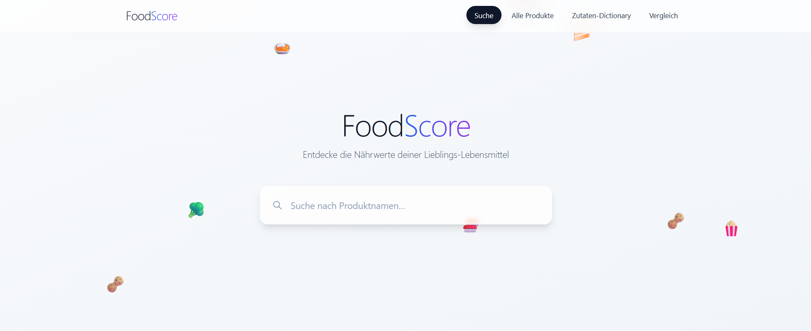
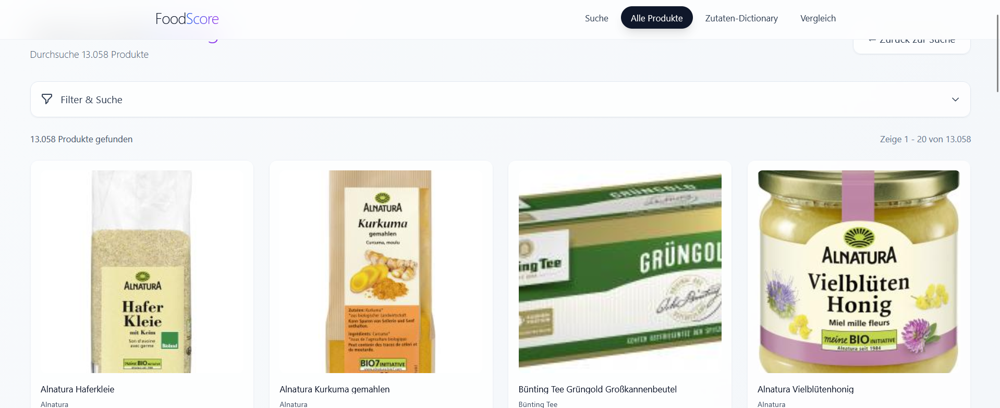
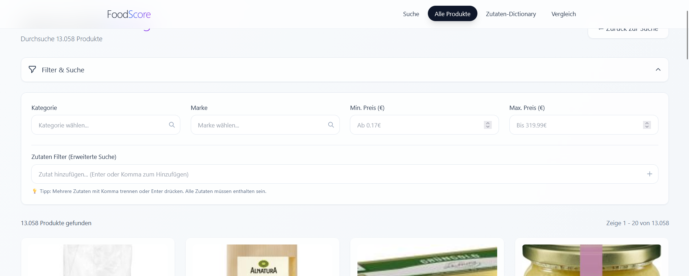
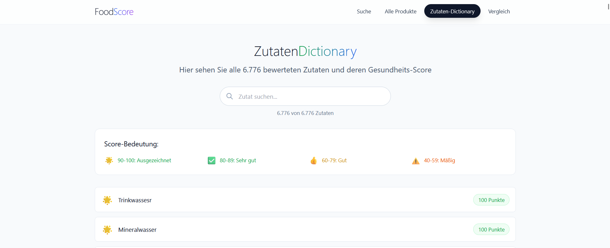
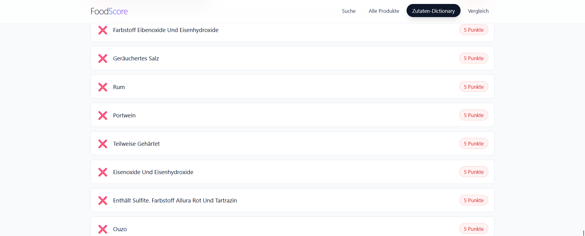
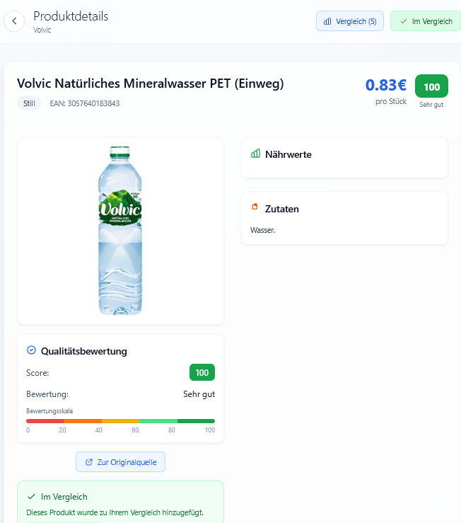
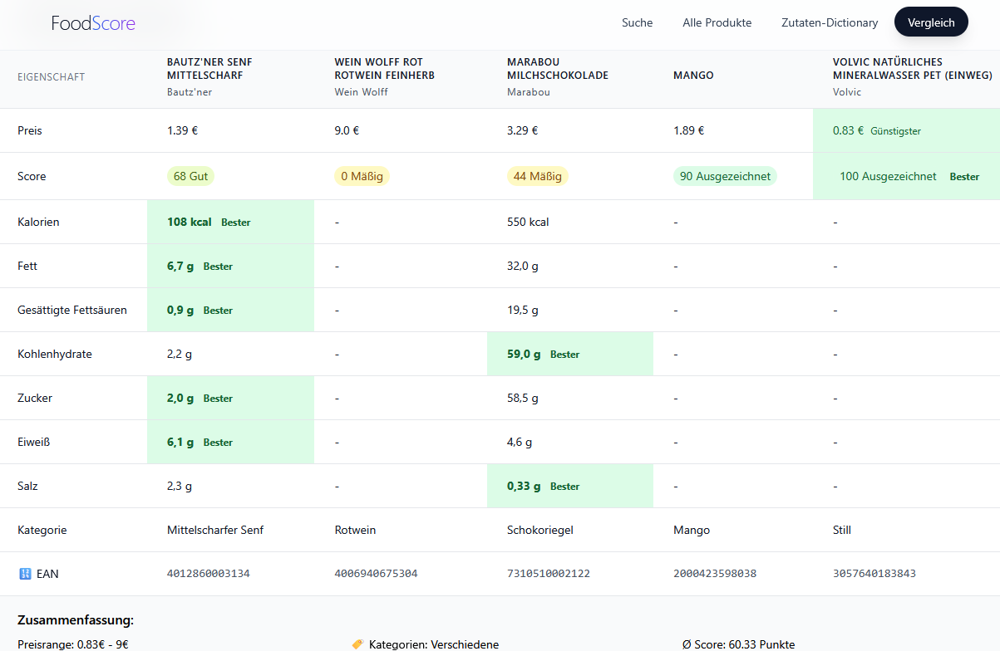
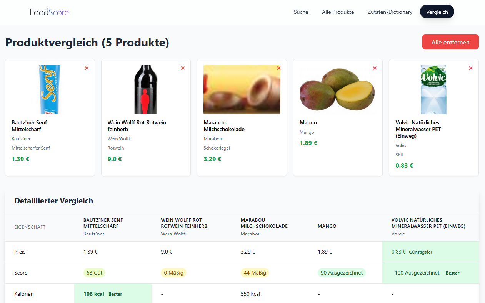

## 📸 Screenshots & Features

### 🏠 Startseite

  

### 📦 Alle Produkte

  

### 🧰 Erweiterte Filteransicht

  

### 📚 Zutaten-Dictionary

  

### ⚠️ Kritische Zutaten

  

### 🔎 Produktdetails & FoodScore

  

### 📊 Produktvergleich – Detailtabelle

  

### 🆚 Produktvergleich – Übersicht

  

🚀 FoodScore – Fullstack Lebensmittelbewertungssystem
🧠 Projektidee

FoodScore ist eine Fullstack-Webanwendung zur automatisierten Bewertung von Lebensmitteln anhand ihrer Zutatenliste, Nährwerte und Verarbeitungsindikatoren.

💡 Ziel:
Verbrauchern & Händlern eine transparente, leicht verständliche Bewertung der Gesundheit eines Produkts zu liefern – als Alternative zum oft kritisierten Nutri-Score.

Das System umfasst:

- Web-Scraping von tausenden Produkten
- Datenbereinigung & Datenbankmodell
- KI-unterstützte Zutatenbewertung
- mathematische Bewertungsformel
- Fullstack Web-App (React + Spring Boot)

⭐ Kernfeatures
🔎 Produktsuche & Autocomplete

Finde Produkte in Echtzeit mittels Prefix-Suche & Ergebnisvorschlägen.

🛒 Produktdetails

Jedes Produkt zeigt:

- Name, Kategorie, Marke
- Bild
- Preis
- Zutaten
- Nährwerte
- FoodScore (0–100) + verbale & farbliche Klassifizierung

📊 Produktvergleich

Vergleiche bis zu fünf Produkte:

- Preis
- Score
- Kalorien
- Fett / Zucker / Salz
- Nährwertmatrix
- Zusammenfassender “Winner Report”

📚 Zutaten-Lexikon

Alle bewerteten Zutaten + ihre Scores in einer browsable Liste.

⚙️ Backend-Funktionen

- Score-Berechnung für einzelne oder alle Produkte
- Filter: Kategorie | Marke | Preisbereich | Zutaten
- REST-API für zukünftige mobile Apps nutzbar

🧮 FoodScore-Formel (Kurzfassung)

Die Formel kombiniert:

- Zutatenqualität (Si) – KI-Bewertung jeder Zutat (1–100)
- Positionsgewichtung (Gi = 1 / √(i+1))
- Verarbeitungsgrad-Malus basierend auf der Zutatenlistenlänge
- Gewichteter Durchschnitt – Malus → Endscore 0–100

🧪 KI-gestützte Zutatenbewertung

Zur Score-Zuweisung der 1000+ Zutaten wurde GPT-5 Thinking Mode genutzt:

- evidenzbasierte Scoring-Kriterien
- weniger Bias als manuelle Bewertungen
- konsistente Normalisierung von Zutatenvarianten
- reproduzierbare Bewertungspipeline

🧱 Technologie-Stack

Frontend:

- React (Vite)
- TailwindCSS
- Axios
- React Router
- Zustand / lokale Hooks für State Management

Backend:

- Java 21
- Spring Boot 3.5
- Spring Data JPA
- REST API
- Zutaten-Parser & Score-Engine

Datenbank:

- PostgreSQL 15
- CSV-Import über pgAdmin
- Entities: produkt & zutaten_score

Scraping / Data Engineering:

- Python
- Playwright (Browser-Automation)
- BeautifulSoup (HTML Parsing)
- ETL-Pipeline über Python-Skripte

🏛️ Softwarearchitektur

- Schichtenarchitektur (Controller, Service, Repository)
- Ergänzt durch MVC-Komponenten im Web-Kontext
- Loose Coupling via REST
- Frontend & Backend vollständig getrennt deploybar
- Datenbereinigung mit ETL-Ansatz

📂 Projektstruktur

FoodScore/
│
├── Frontend/
│   └── lebensmittel-score-frontend/
│       ├── src/
│       │   ├── assets/
│       │   │   └── react.svg
│       │   ├── Clients/
│       │   │   ├── ProduktClient.js
│       │   │   └── VergleichsClient.js
│       │   ├── components/
│       │   │   └── ScoreBadge.jsx
│       │   ├── hooks/
│       │   │   └── ProduktVergleich.js
│       │   ├── App.jsx
│       │   ├── FliegendeEmojis.jsx
│       │   ├── LebensmittelListe.jsx
│       │   ├── main.jsx
│       │   ├── ProduktDetails.jsx
│       │   ├── Suche.jsx
│       │   ├── VergleichsSeite.jsx
│       │   └── ZutatenListe.jsx
│       │
│       ├── public/
│       │   └── vite.svg
│       ├── package.json
│       ├── package-lock.json
│       ├── vite.config.js
│       ├── tailwind.config.js
│       ├── eslint.config.js
│       ├── PriceRangeSlider.jsx
│       ├── index.html
│       ├── postcss.config.js
│       └── README.md
│
├── docs/
│   └── Installation_Guide.pdf
│
├── src/
│   └── main/
│       ├── java/com/example/FoodScore/
│       │   ├── Controller/
│       │   │   ├── ProduktController.java
│       │   │   ├── ProduktScoreController.java
│       │   │   └── VergleichController.java
│       │   │
│       │   ├── Persistenz/
│       │   │   ├── Daten/
│       │   │   │   ├── edeka24Daten.csv
│       │   │   │   ├── Lebensmitteldaten.csv
│       │   │   │   └── myTimeDaten.csv
│       │   │   ├── Produkt.java
│       │   │   ├── ProduktRepository.java
│       │   │   └── ZutatenScore.java
│       │   │
│       │   ├── Service/
│       │   │   ├── ProduktService.java
│       │   │   ├── ProduktScoreService.java
│       │   │   ├── ZutatenDictionary.java
│       │   │   └── ZutatenFileLoader.java
│       │   │
│       │   └── FoodScoreApplication.java
│       │
│       └── resources/
│           ├── application.properties
│           └── Zutatenliste mit Scores.py
│
├── .gitignore
├── .gitattributes
├── pom.xml
├── Commands für uns
├── mvnw
├── mvnw.cmd
└── README.md

Wichtig: Die Installation_Guide.pdf enthält alle Setup-Schritte — bitte zuerst lesen.

Backend starten:

- cd foodscore
- mvn clean install
- mvn spring-boot:run

Frontend starten:

- cd Frontend/lebensmittel-score-frontend
- npm install
- npm run dev

🎯 Ziele & Mehrwert

Für Nutzer:

✔ verständlicher Gesundheits-Score
✔ bessere Kaufentscheidungen
✔ Transparenz über komplexe Zutatenlisten

Für Händler:

✔ Produktsortiment optimieren
✔ Preis-Leistungs-Strategien
✔ Trends zu “gesunden Produkten” nutzen

📜 Lizenz
MIT License – Nutzung für Studium & private Projekte erlaubt.

———————————————————————————————————————————
Ein Projekt der Universität Duisburg-Essen
———————————————————————————————————————————

👥 Team

| Name                         | Rolle                                                         |
| ---------------------------- | ------------------------------------------------------------- |
| **Özgürcan**                 | Backend Lead, Score-Parser, Formel, wissenschaftliche Kapitel |
| **Emirhan**                  | Bewertungslogik, wissenschaftlicher Teil, Validierung         |
| **Cenk**                     | Frontend Lead, Edeka-Scraper, Architektur                     |
| **Ratheesh**                 | MyTime-Scraper, Nährwert-Recherche, Projektmethodik           |
| **Demian**                   | Stakeholder-Analyse, Ökonomie, GitLab-Management              |
